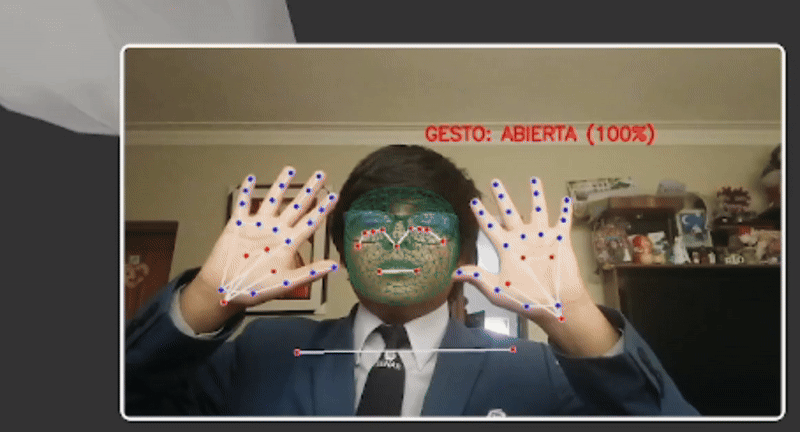
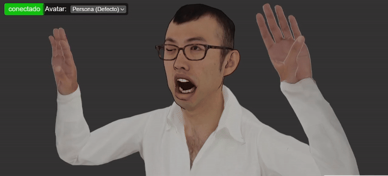
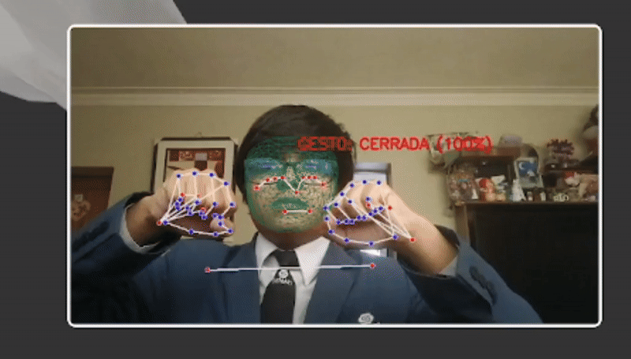
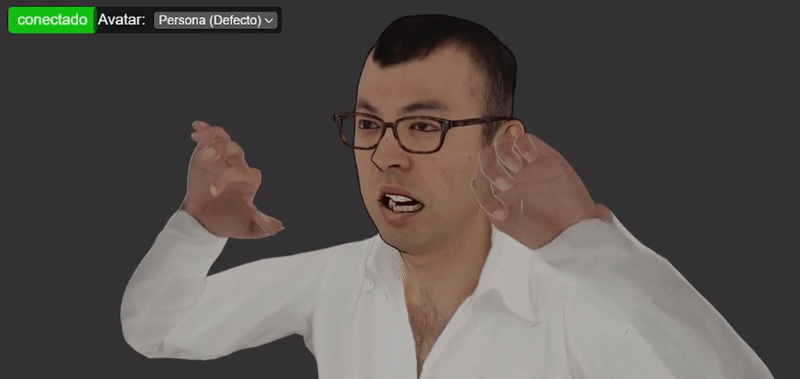

# FACE_MAKES
proyecto semestre 4

# DETECCION DE LIKE(LIKE)

# DETECCION DE ENOJADO(PUÑO)

# DETECCION DE SORPRENDIDO(MANOS ABIERTAS)

https://www.kaggle.com/datasets/vrajesh0sharma7/sign-language

